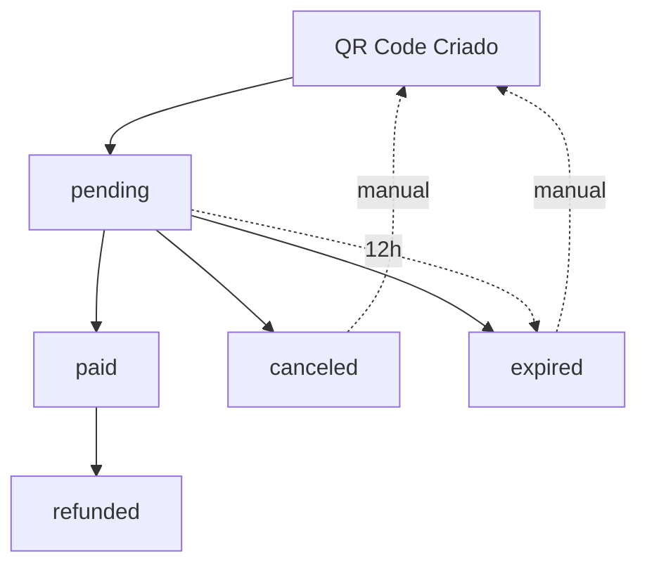
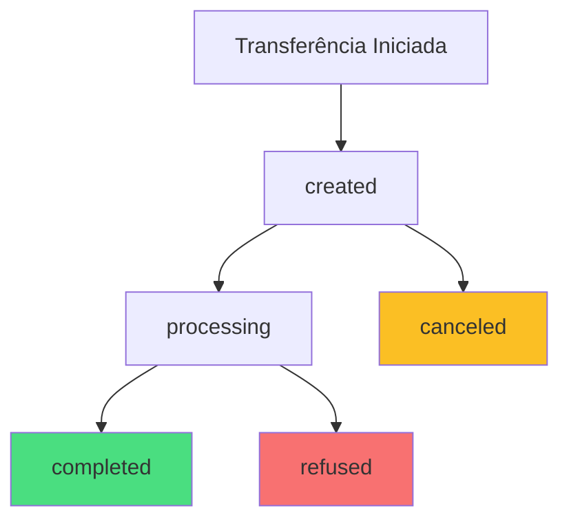

Esta página fornece uma referência completa dos status de transações, códigos de erro HTTP e códigos de resposta específicos da API Quantum Pay.

## Status de transações (PIX IN)

### Estados do ciclo de vida

| Status | Descrição | Tempo Típico | Próxima Ação |
|--------|-----------|--------------|---------------|
| `pending` | Aguardando pagamento | 0-12 horas | Mostrar QR Code para cliente |
| `paid` | Pago com sucesso | Instantâneo | Liberar produto/serviço |
| `canceled` | Cancelado | Manual | Gerar novo QR Code se necessário |
| `refunded` | Estornado | 1-3 dias úteis | Valor devolvido ao pagador |
| `expired` | Expirado | 12 horas | Gerar nova cobrança |

### Fluxo visual



### Detalhes por status

<AccordionGroup>
  <Accordion title="pending - Aguardando pagamento" icon="clock">
    **Quando ocorre:** QR Code foi gerado com sucesso  
    **Duração:** Até 12 horas ou até ser pago  
    **Webhook:** `transaction_created`
    
    **Ações recomendadas:**
    - Exibir QR Code para o cliente
    - Iniciar polling de status ou aguardar webhook
    - Mostrar contador de tempo para expiração
    
    ```json
    {
      "id": "trx_1a2b3c4d5e6f7g8h9i0j",
      "status": "pending",
      "createdAt": "2024-01-20T10:30:00.000Z",
      "expiresAt": "2024-01-20T22:30:00.000Z"
    }
    ```
  </Accordion>
  
  <Accordion title="paid - Pago com sucesso" icon="check-circle">
    **Quando ocorre:** PIX foi recebido e confirmado  
    **Duração:** Permanente  
    **Webhook:** `transaction_paid`
    
    **Ações recomendadas:**
    - Liberar produto ou serviço imediatamente
    - Enviar email de confirmação
    - Atualizar estoque
    - Iniciar processo de entrega
    
    ```json
    {
      "id": "trx_1a2b3c4d5e6f7g8h9i0j",
      "status": "paid",
      "paidAt": "2024-01-20T10:35:22.000Z",
      "pix": {
        "endToEndId": "E00000000202401011200000000000000"
      }
    }
    ```
  </Accordion>
  
  <Accordion title="canceled - Cancelado" icon="x-circle">
    **Quando ocorre:** Cancelamento manual ou automático  
    **Duração:** Permanente  
    **Webhook:** `transaction_canceled`
    
    **Ações recomendadas:**
    - Informar cliente sobre cancelamento
    - Gerar novo QR Code se necessário
    - Limpar carrinho ou sessão
    
    ```json
    {
      "id": "trx_1a2b3c4d5e6f7g8h9i0j",
      "status": "canceled",
      "canceledAt": "2024-01-20T11:00:00.000Z",
      "reason": "Cancelado pelo usuário"
    }
    ```
  </Accordion>
  
  <Accordion title="refunded - Estornado" icon="arrow-rotate-left">
    **Quando ocorre:** Estorno processado com sucesso  
    **Duração:** Permanente  
    **Webhook:** `transaction_refunded`
    
    **Ações recomendadas:**
    - Cancelar entrega se ainda não enviada
    - Restaurar estoque
    - Notificar cliente sobre estorno
    - Atualizar sistemas financeiros
    
    ```json
    {
      "id": "trx_1a2b3c4d5e6f7g8h9i0j",
      "status": "refunded",
      "refund": {
        "amount": 29990,
        "refundedAt": "2024-01-22T14:20:00.000Z",
        "reason": "Solicitação do cliente"
      }
    }
    ```
  </Accordion>
</AccordionGroup>

## Status de transferências (PIX OUT)

### Estados do ciclo de vida

| Status | Descrição | Tempo Típico | Próxima Ação |
|--------|-----------|--------------|---------------|
| `created` | Criada e validada | Instantâneo | Aguardar processamento |
| `processing` | Em processamento | 1-10 segundos | Aguardar conclusão |
| `completed` | Concluída com sucesso | 3-15 segundos | Transferência realizada |
| `canceled` | Cancelada pelo sistema | 5-30 segundos | Verificar motivo |
| `refused` | Recusada pela instituição | 10-60 segundos | Verificar dados |

### Fluxo visual



### Detalhes por status

<AccordionGroup>
  <Accordion title="created - Criada e validada" icon="plus-circle">
    **Quando ocorre:** Transferência foi aceita e validada  
    **Duração:** 1-3 segundos  
    **Webhook:** `transfer_created`
    
    **Características:**
    - Dados validados com sucesso
    - Saldo verificado e reservado
    - Chave PIX validada
    
    ```json
    {
      "id": "transfer_abc123def456",
      "status": "created",
      "amount": 10000,
      "pixKey": "fornecedor@exemplo.com",
      "createdAt": "2024-01-20T15:30:00.000Z"
    }
    ```
  </Accordion>
  
  <Accordion title="processing - Em processamento" icon="arrows-rotate">
    **Quando ocorre:** Transferência sendo processada pelo sistema  
    **Duração:** 3-10 segundos  
    **Webhook:** `transfer_updated`
    
    **Características:**
    - Comunicação com o SPI (Sistema de Pagamentos Instantâneos)
    - Verificação final de dados
    - Processamento da transferência
    
    ```json
    {
      "id": "transfer_abc123def456",
      "status": "processing",
      "amount": 10000,
      "processingAt": "2024-01-20T15:30:02.000Z"
    }
    ```
  </Accordion>
  
  <Accordion title="completed - Concluída" icon="check-circle">
    **Quando ocorre:** Transferência PIX concluída com sucesso  
    **Duração:** Permanente  
    **Webhook:** `transfer_completed`
    
    **Características:**
    - Dinheiro transferido com sucesso
    - End-to-End ID gerado
    - Comprovante disponível
    
    ```json
    {
      "id": "transfer_abc123def456",
      "status": "completed",
      "amount": 10000,
      "netAmount": 10000,
      "fees": 0,
      "completedAt": "2024-01-20T15:30:08.000Z",
      "pix": {
        "endToEndId": "E00000000202401011200000000000000"
      }
    }
    ```
  </Accordion>
  
  <Accordion title="refused - Recusada" icon="x-circle">
    **Quando ocorre:** Transferência recusada pela instituição  
    **Duração:** Permanente  
    **Webhook:** `transfer_refused`
    
    **Motivos comuns:**
    - Chave PIX não encontrada
    - Conta de destino inativa
    - Limites de recebimento excedidos
    - Problemas técnicos temporários
    
    ```json
    {
      "id": "transfer_abc123def456",
      "status": "refused",
      "amount": 10000,
      "refusedAt": "2024-01-20T15:30:15.000Z",
      "reason": "Chave PIX não encontrada"
    }
    ```
  </Accordion>
</AccordionGroup>

## ❌ Códigos de Erro HTTP

### Códigos de Sucesso (2xx)

| Código | Descrição | Uso Comum |
|--------|-----------|-----------|
| `200` | OK | Operação bem-sucedida |
| `201` | Created | Recurso criado com sucesso |
| `204` | No Content | Operação bem-sucedida sem conteúdo |

### Códigos de Erro do Cliente (4xx)

| Código | Erro | Descrição | Solução |
|--------|------|-----------|---------|
| `400` | Bad Request | Dados inválidos na requisição | Verificar formato dos dados |
| `401` | Unauthorized | Token inválido ou ausente | Renovar token de acesso |
| `403` | Forbidden | Sem permissão para a operação | Verificar permissões da API Key |
| `404` | Not Found | Recurso não encontrado | Verificar ID do recurso |
| `409` | Conflict | Conflito na operação | Verificar estado do recurso |
| `422` | Unprocessable Entity | Dados não processáveis | Verificar regras de negócio |
| `429` | Too Many Requests | Rate limit excedido | Aguardar e tentar novamente |

### Códigos de Erro do Servidor (5xx)

| Código | Erro | Descrição | Solução |
|--------|------|-----------|---------|
| `500` | Internal Server Error | Erro interno do servidor | Tentar novamente ou contatar suporte |
| `502` | Bad Gateway | Erro de gateway | Aguardar alguns minutos |
| `503` | Service Unavailable | Serviço temporariamente indisponível | Aguardar e tentar novamente |
| `504` | Gateway Timeout | Timeout no gateway | Tentar novamente |

## Códigos de erro específicos

### Erros de Autenticação

| Código | Mensagem | Causa | Solução |
|--------|----------|-------|---------|
| `AUTH_001` | Token expirado | Token JWT expirou | Gerar novo token |
| `AUTH_002` | Token inválido | Token malformado | Verificar formato do token |
| `AUTH_003` | Credenciais inválidas | API Key/Secret incorretos | Verificar credenciais |
| `AUTH_004` | Acesso negado | Sem permissão | Verificar escopo da API Key |

### Erros de PIX IN

| Código | Mensagem | Causa | Solução |
|--------|----------|-------|---------|
| `PIX_IN_001` | Valor inválido | Valor fora dos limites | Verificar valor mín/máx |
| `PIX_IN_002` | CPF/CNPJ inválido | Documento malformado | Validar documento |
| `PIX_IN_003` | Email inválido | Formato de email incorreto | Verificar email |
| `PIX_IN_004` | QR Code expirado | Tentativa de uso após expiração | Gerar novo QR Code |

### Erros de PIX OUT

| Código | Mensagem | Causa | Solução |
|--------|----------|-------|---------|
| `PIX_OUT_001` | Saldo insuficiente | Não há saldo na conta | Verificar saldo |
| `PIX_OUT_002` | Chave PIX inválida | Formato da chave incorreto | Validar chave PIX |
| `PIX_OUT_003` | Limite diário excedido | Limite de transferências atingido | Aguardar próximo dia |
| `PIX_OUT_004` | Destinatário indisponível | Chave PIX não encontrada | Verificar chave PIX |

### Erros de Webhook

| Código | Mensagem | Causa | Solução |
|--------|----------|-------|---------|
| `WEBHOOK_001` | URL inválida | Formato incorreto da URL | Verificar URL |
| `WEBHOOK_002` | URL não acessível | Endpoint não responde | Verificar conectividade |
| `WEBHOOK_003` | Evento inválido | Evento não existe | Usar eventos válidos |
| `WEBHOOK_004` | Limite excedido | Muitos webhooks configurados | Remover webhooks antigos |

## Estrutura de resposta de erro

### Formato Padrão

```json
{
  "success": false,
  "error": {
    "code": "PIX_IN_001",
    "message": "Valor deve ser maior que R$ 0,01",
    "field": "amountInCents",
    "details": {
      "minimumValue": 1,
      "providedValue": 0
    }
  },
  "timestamp": "2024-01-20T10:30:00.000Z",
  "requestId": "req_abc123def456ghi789"
}
```

### Campos da Resposta

| Campo | Tipo | Descrição |
|-------|------|-----------|
| `success` | `boolean` | Sempre `false` para erros |
| `error.code` | `string` | Código específico do erro |
| `error.message` | `string` | Mensagem descritiva do erro |
| `error.field` | `string` | Campo que causou o erro (opcional) |
| `error.details` | `object` | Informações adicionais (opcional) |
| `timestamp` | `string` | Data/hora do erro |
| `requestId` | `string` | ID único da requisição |

## Tratamento de erros

### Exemplo de Implementação Robusta

```javascript
class APIErrorHandler {
  static handle(error) {
    switch (error.status) {
      case 400:
        return this.handleBadRequest(error)
      case 401:
        return this.handleUnauthorized(error)
      case 403:
        return this.handleForbidden(error)
      case 404:
        return this.handleNotFound(error)
      case 422:
        return this.handleUnprocessableEntity(error)
      case 429:
        return this.handleRateLimit(error)
      case 500:
        return this.handleInternalError(error)
      default:
        return this.handleUnknownError(error)
    }
  }

  static handleBadRequest(error) {
    const errorCode = error.response?.data?.error?.code
    
    switch (errorCode) {
      case 'PIX_IN_001':
        throw new Error('Valor inválido. Verifique se o valor está dentro dos limites permitidos.')
      case 'PIX_IN_002':
        throw new Error('CPF/CNPJ inválido. Verifique o número do documento.')
      case 'PIX_OUT_002':
        throw new Error('Chave PIX inválida. Verifique o formato da chave.')
      default:
        throw new Error('Dados inválidos. Verifique os parâmetros enviados.')
    }
  }

  static async handleUnauthorized(error) {
    console.log('Token expirado, renovando...')
    
    // Tentar renovar token automaticamente
    try {
      await auth.renewToken()
      return { shouldRetry: true }
    } catch (renewError) {
      throw new Error('Falha na autenticação. Verifique suas credenciais.')
    }
  }

  static async handleRateLimit(error) {
    const retryAfter = error.response?.headers['retry-after'] || 60
    
    console.log(`Rate limit atingido. Aguardando ${retryAfter} segundos...`)
    
    return { 
      shouldRetry: true, 
      retryAfter: retryAfter * 1000 
    }
  }

  static handleInternalError(error) {
    const requestId = error.response?.data?.requestId
    
    throw new Error(
      `Erro interno do servidor. ` +
      `Entre em contato com o suporte informando o ID: ${requestId}`
    )
  }
}

// Uso
async function makeAPICall(apiFunction, ...args) {
  const maxRetries = 3
  let attempt = 0

  while (attempt < maxRetries) {
    try {
      return await apiFunction(...args)
    } catch (error) {
      attempt++
      
      const handled = APIErrorHandler.handle(error)
      
      if (handled?.shouldRetry && attempt < maxRetries) {
        if (handled.retryAfter) {
          await new Promise(resolve => setTimeout(resolve, handled.retryAfter))
        }
        continue
      }
      
      throw error
    }
  }
}
```

### Rate Limiting Inteligente

```javascript
class RateLimiter {
  constructor() {
    this.requests = new Map()
  }

  async waitIfNeeded(endpoint) {
    const now = Date.now()
    const requests = this.requests.get(endpoint) || []
    
    // Limpar requisições antigas (mais de 1 minuto)
    const recentRequests = requests.filter(time => now - time < 60000)
    
    // Verificar limite por endpoint
    const limits = {
      '/api/auth': 5,
      '/api/v1/pix/in/qrcode': 100,
      '/api/v1/pix/out/pixkey': 50,
      '/api/v1/webhook': 30
    }
    
    const limit = limits[endpoint] || 100
    
    if (recentRequests.length >= limit) {
      const oldestRequest = Math.min(...recentRequests)
      const waitTime = 60000 - (now - oldestRequest)
      
      console.log(`Rate limit atingido para ${endpoint}. Aguardando ${waitTime}ms...`)
      await new Promise(resolve => setTimeout(resolve, waitTime))
    }
    
    // Registrar nova requisição
    recentRequests.push(now)
    this.requests.set(endpoint, recentRequests)
  }
}
```

---

## Próximos passos

<CardGroup cols={2}>
  <Card title="❌ Códigos de Erro" icon="triangle-exclamation" href="/pages/reference/errors">
    Guia completo para tratamento de erros
  </Card>
  <Card title="Rate limits" icon="chart-line" href="/pages/reference/rate-limits">
    Entenda os limites de requisições
  </Card>
  <Card title="PIX IN" icon="qrcode" href="/pages/pix-in/overview">
    Comece a receber pagamentos PIX
  </Card>
  <Card title="PIX OUT" icon="bolt" href="/pages/pix-out/overview">
    Envie transferências PIX
  </Card>
</CardGroup> 
